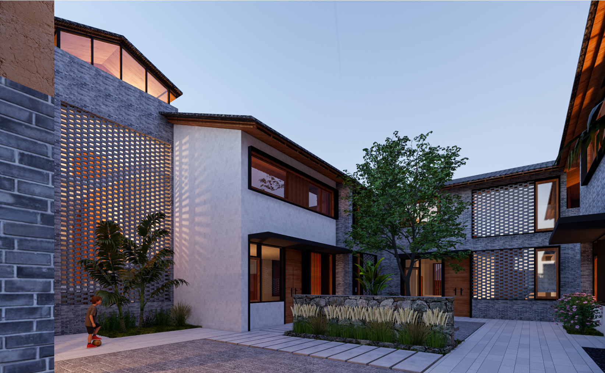

# gsyang-site

从 [sites.google.com/view/gsyang](https://sites.google.com/view/gsyang/home) 复刻的静态网站，纯 HTML + CSS，零构建步骤，可以直接用 GitHub Pages 发布。

## 文件结构

```
gsyang-site/
├─ index.html                 首页
├─ about.html                 关于我
├─ work.html                  作品总览
├─ work-architecture.html     建筑作品（8个项目，已按原站文字填好）
├─ work-photography.html      摄影画廊（占位模板）
├─ work-student-work.html     学生作品（占位模板）
├─ work-others.html           其他作品（占位模板）
├─ contact.html                联系方式
├─ styles.css                 全站共用样式
├─ images/                    放你自己的图片
└─ files/                     放 CV 等文件
```

## 加你自己的图片

原网站的图片存在 Google 的服务器上（`lh3.googleusercontent.com`），没法直接下载搬过来。每个应该放图片的地方，现在都是一个带虚线边框、写着文件名的占位格，例如：

```html
<div class="img-slot"><span>images/architecture-01.jpg</span></div>
```

把它换成真正的图片标签就行：

```html

```

1. 打开你原来的 Google Sites 页面，右键图片 → 另存为，把图片下载下来
2. 放进本项目的 `images/` 文件夹，文件名随意，但要和 `src=""` 里写的一致
3. 按上面的方式把占位 `<div class="img-slot">` 换成 `` 标签

摄影 / 学生作品 / 其他作品这三页目前只是模板（`work-photography.html` 里放了 12 个占位格演示网格效果，另外两页各放了 6 个）。把 `<div class="img-slot square"></div>` 这一整块复制、粘贴到你需要的数量，再逐个换成 `` 就能放下所有照片。

## CV 文件

`about.html` 里的下载按钮指向 `files/CV-Guosheng-YANG.pdf`，这个文件还不存在。把你的简历 PDF 放进新建的 `files/` 文件夹，文件名对上就行。

## 本地预览

不需要装任何东西，用浏览器直接打开 `index.html` 就能看。想要更接近真实网站的体验（比如相对路径、字体加载），也可以用 VS Code 的 "Live Server" 插件，或者在这个文件夹里跑：

```bash
python3 -m http.server 8000
```

然后浏览器打开 `http://localhost:8000`。

## 发布到 GitHub Pages

1. 在 GitHub 上新建一个仓库。如果想要 `https://<用户名>.github.io` 这种最简短的个人主页地址，仓库名要精确写成 `<你的GitHub用户名>.github.io`；随便起别的名字也可以，网址会是 `https://<用户名>.github.io/<仓库名>`。
2. 在这个文件夹里初始化 git 并推送：
   ```bash
   git init
   git add .
   git commit -m "first version"
   git branch -M main
   git remote add origin https://github.com/<你的用户名>/<仓库名>.git
   git push -u origin main
   ```
3. 打开仓库的 Settings → Pages，Source 选 "Deploy from a branch"，Branch 选 `main` / `/(root)`，保存。
4. 等 1–2 分钟，Settings → Pages 顶部会出现发布好的网址，就能访问了。
5. 以后想更新内容，改完文件后 `git add . && git commit -m "更新说明" && git push`，一两分钟后网站会自动刷新。

## 说明

- 页面里的邮箱地址已经修正：原网站显示的地址是 `gyang559@connect.hkust-gz.edu.cn`，但网页里的实际链接指向 `gyang559@connet.hkust-gz.com`（拼写和后缀都不对），这里统一用了显示出来的正确地址。
- "Chief Designer" 在原网站上拼成了 "Cheif Designer"，这里顺手改了过来，其余项目信息（地点 / 角色 / 规模 / 状态 / 描述）都是按原文照录的。
- Student Work、Others 两页我没有单独抓取原文内容，先按 Photography 页同样的结构搭了模板，需要你对照原页面把真实内容填进去。
